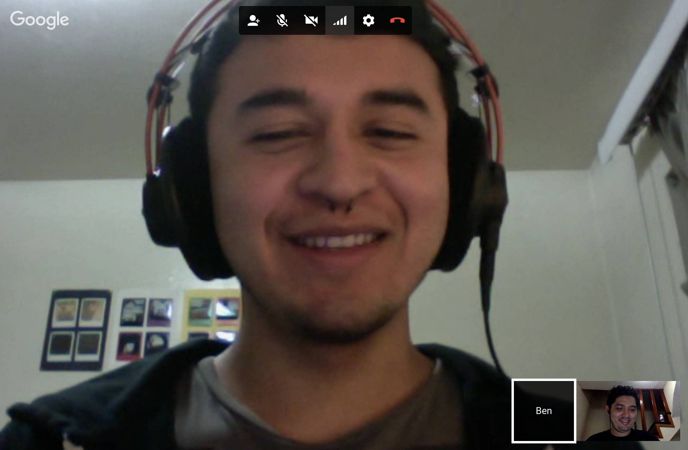

# My first Gps Pairing

A really **good** experience, i *hope* to have other one soon.

We use.
`git clone`
`git status`
`git add`
`git pull`
`git merge`

Also do some markdown example, we got help from [Github articles](https://help.github.com/articles/basic-writing-and-formatting-syntax/).

Here's a photo for the memories.

